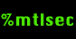

# Prochaine édition: lundi le 21 avril 2014
[English version](#english)

La prochaine édition de Montréhack aura lieu lundi le 21 avril 2014.

## NorthSec Pré-party!

Montréhack fait un spécial pré-northsec ce mois-ci avec une édition de
réseautage et discussions quelques jours avant NorthSec. Du plaisir garanti
avec les membres de plusieurs communautés infosec du Québec!

RSVP question de pouvoir réserver assez d'espace:
https://www.eventbrite.ca/e/montrehack-avril-april-northsec-pre-party-tickets-11232307133

En collaboration avec :

Outils nécessaires :

* socialdbg
* overflow mitigation

## Où

Benelux Sherbrooke

* 245, rue Sherbrooke Ouest
* http://www.brasseriebenelux.com/sherbrooke

## Quand
Lundi le 21 avril de 18h à 21h (minimum!)

# Next edition: Monday April 21st 2014

The next edition of Montrehack will be held on Monday April 21st 2014.

## NorthSec pre-party!

Montréhack hosts a special pre-northsec party this month with networking and
discussions just a few days short of NorthSec. Great fun with several infosec
communities!

RSVP will be required to reserve enough room for the group:
https://www.eventbrite.ca/e/montrehack-avril-april-northsec-pre-party-tickets-11232307133

In collaboration with:

Tools required:

* socialdbg
* overflow mitigation

## Where

Benelux Sherbrooke

* 245, rue Sherbrooke Ouest
* http://www.brasseriebenelux.com/sherbrooke

## When
Monday April 21st from 6:00 to 9:00 pm (minimum!)

[Intéressé à présenter? / Interested to present a challenge?](https://github.com/montrehack/montrehack.github.com/wiki/Present-at-Montrehack)
