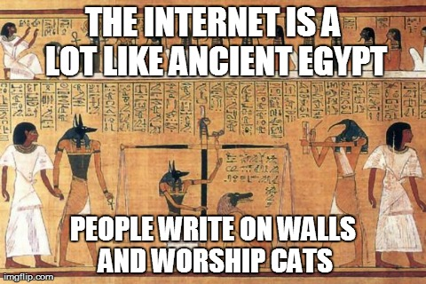

# Prochaine édition / Next event

[English version](#english)

## 2015-04-20
## NileSide

Au menu ce mois-ci, un challenge de Boston Key Party 2015. Description originale : "OMG !!, 1 7hink N5A disc0vered my super secure login. 1 c4ugh7 7h3m 3xfiLLing 7h1s pc4p, Am 1 t00 fuxx3d?"

## Inscription

**Inscription obligatoire**: merci de vous inscrire sur le lien suivant: 
https://www.eventbrite.ca/e/montrehack-avril-2015-tickets-16373213723

## Où :

[Google Montreal](https://www.google.ca/about/careers/locations/montreal/#tab=tab-map)

1253 McGill College  
Montréal, QC  
H3B 2Y5

## Quand :

Lundi, 20 avril 2015 de 18h à 21h (suivi de bières au Bénélux)

## Outils nécessaires:

* Wireshark/tshark
* un langage de programmation : Python, Ruby, Perl, Java, Go etc.
* un editeur d'image (Paint.NET/Gimp/Photoshop) et/ou une librairie pour générer des graphes (Graphviz)

Présenté par Tito (Taher Azab)

**English version**

## 2015-04-20
## NileSide

This month we will be working on a Boston Key Party 2015 forensics challenge. Original challenge description : "OMG !!, 1 7hink N5A disc0vered my super secur    e login. 1 c4ugh7 7h3m 3xfiLLing 7h1s pc4p, Am 1 t00 fuxx3d?"

## Registration

**It is mandatory to register**, please register by following the link: https://www.eventbrite.ca/e/montrehack-avril-2015-tickets-16373213723

## Where:

[Google Montreal](https://www.google.ca/about/careers/locations/montreal/#tab=tab-map)

1253 McGill College  
Montréal, QC  
H3B 2Y5

## When:

Monday, April 20th 2015 from 6pm to 9pm (followed by drinks at Bénélux)

## Required Tools:

* Wireshark/tshark
* a scripting language of your choice : Python, Ruby, Perl, Java, Go etc.
* an image editor (Paint.NET/Gimp/Photoshop) and/or a graphing library (Graphviz)

Presented by Tito (Taher Azab)

[Intéressé à présenter? / Interested to present a challenge?](https://github.com/montrehack/montrehack.github.com/wiki/Present-at-Montrehack)
