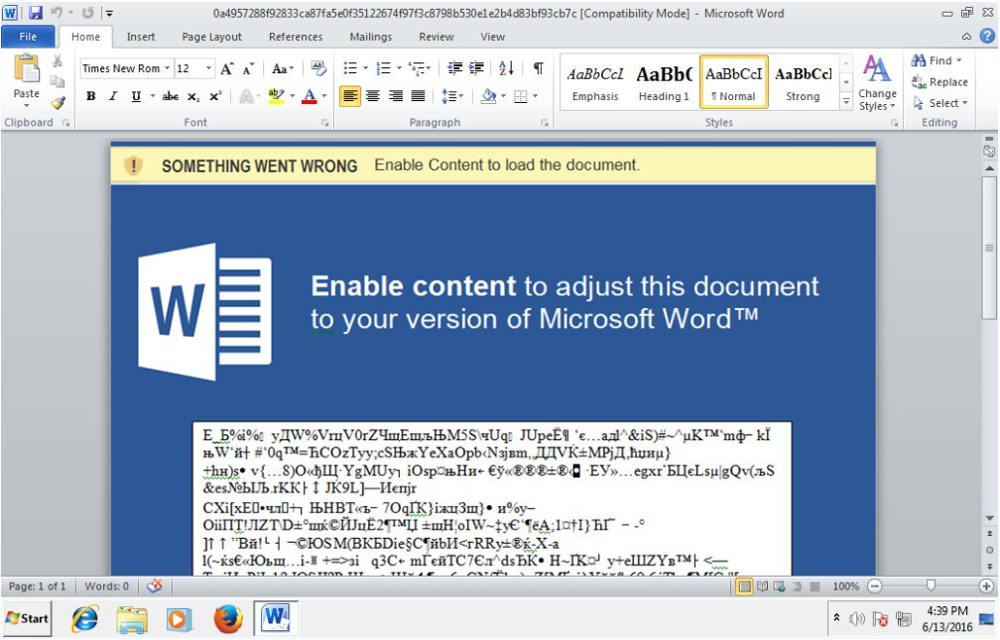

# Prochaine édition: lundi le 19 décembre 2016
[English version](#english)

La prochaine édition de Montréhack aura lieu lundi le 19 décembre 2016.

## Les documents malicieux

Note: Ce mois-ci nous changeons notre formule CTF pour une formule workshop en
sécurité. Laissez-nous savoir si ça vous plaît (ou pas).

Nous allons analyser deux cas de vrais documents malicieux Office reçus par
courriel au Québec. Un assez simple et un autre plus complexe.

Les débutants pourront apprendre tout en s'amusant en analyse dynamique et les
plus chevronés pourront tenter de résoudre les défis en analyse statique.

Les fichiers des défis: [https://github.com/montrehack/challenges/tree/master/2016-12-19](https://github.com/montrehack/challenges/tree/master/2016-12-19)

## Outils nécessaires

Prenez-vous à l'avance car préparer une VM d'analyse de logiciel malveillant
c'est long (téléchargement, installation, etc.)!

* Machine Virtuelle Windows pour analyser des logiciels malveillants ([besoin d'aide?](https://github.com/GoSecure/malboxes/))
* La suite Office ou une version d'essai (dynamique)
* [oletools](https://github.com/decalage2/oletools/)
* [oledump](https://blog.didierstevens.com/programs/oledump-py/)
* [ViperMonkey](https://github.com/decalage2/ViperMonkey/)

## Où

Salle de réception de la [Maison Notman](http://notman.org/) au 3e étage dans le fond

51 Rue Sherbrooke Ouest, Montréal, QC H2X 1X2, Canada

## Quand

Lundi le 19 décembre de 18h à 21h (suivi de bières au Bénélux)

## Comment

* Formule atelier
* Apportez votre ordinateur portable
* Des problèmes seront étudiés et expliqués
* Chaque problème sera analysé en petits groupes
* Les solutions seront présentées avec tout le monde à la fin de la rencontre

## Remerciements

Présenté et créé par Olivier Bilodeau ([@obilodeau](https://twitter.com/obilodeau))

Aussi créé par les auteurs de logiciels malveillants.

# Next edition: Monday December 19th 2016

The next edition of Montrehack will be held on Monday December 19th 2016.

## Malicious Documents

Note: This month, we are changing our usual CTF formula in favor of a more
general security workshop. Let us know if you like it (or not).

We will analyze two real-world cases of malicious Office documents received by email in Quebec.
One is simple and the other is more complex.

Beginners will learn while having fun doing dynamic analysis and advanced
analysts will attempt to resolve the challenges solely with static analysis.

Challenge files: [https://github.com/montrehack/challenges/tree/master/2016-12-19](https://github.com/montrehack/challenges/tree/master/2016-12-19)

## Needed Tools

Plan before Montrehack! Preparing an analysis VM takes a while (download,
install, etc.) so be ready before Monday.

* Windows Virtual Machine ready to analyze malware ([need a hand?](https://github.com/GoSecure/malboxes/))
* Office, at least a trial (dynamic analysis)
* [oletools](https://github.com/decalage2/oletools/)
* [oledump](https://blog.didierstevens.com/programs/oledump-py/)
* [ViperMonkey](https://github.com/decalage2/ViperMonkey/)

## Where

Reception room of [Maison Notman](http://notman.org/) on the 3rd floor in the new section

51 Rue Sherbrooke Ouest, Montréal, QC H2X 1X2 Canada

## When

Monday December 19th from 6pm to 9pm (followed by drinks at Bénélux)

## How

* Workshop style
* Bring your own laptop
* Challenges will be analyzed
* Small groups of people can work on each challenge
* Solutions to each challenge will be presented to everyone at the end of the event

## Credits

Presented and created by Olivier Bilodeau ([@obilodeau](https://twitter.com/obilodeau))

Also created by malware authors.

[Vous souhaitez présenter? / Interested to present a challenge?](https://github.com/montrehack/montrehack.github.com/wiki/Present-at-Montrehack)

### Sponsors // Partenaires

